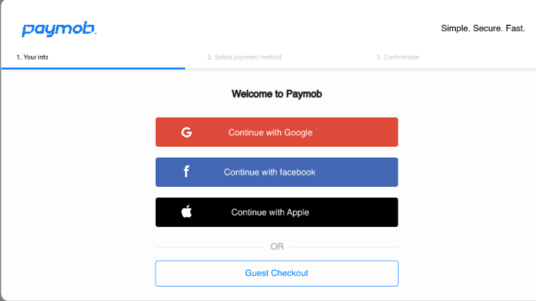
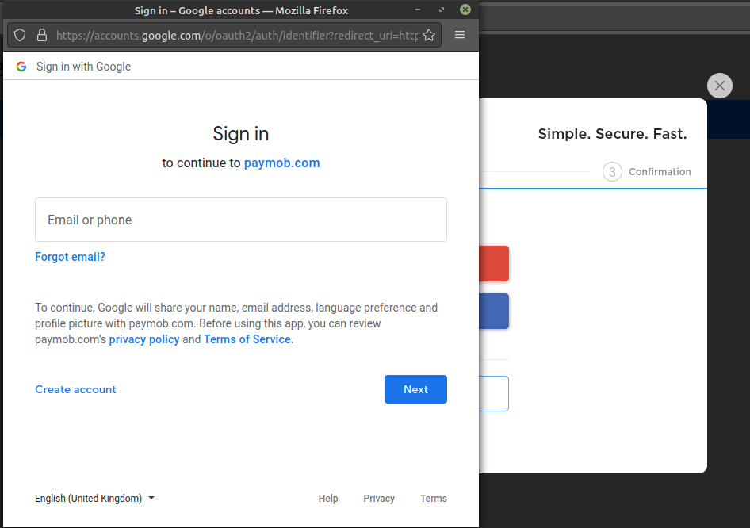
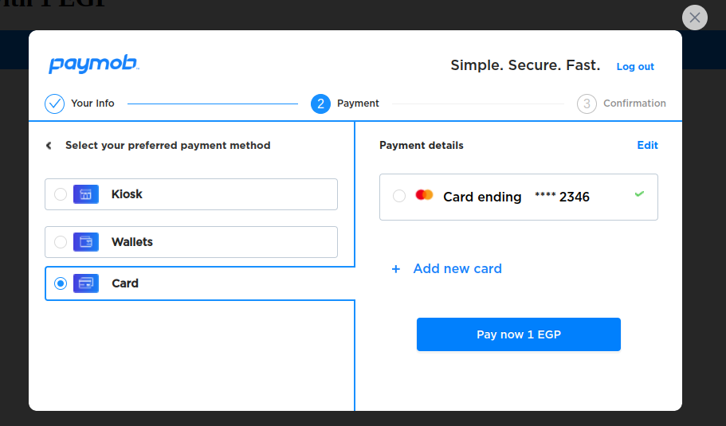

## Paymob flash checkout integration handbook
Paymob Flash Integration Guide.

## What's Inside:
- Paymob flash integration sample in one file. 
- Paymob flash integration sample in two files. 

## How it works:
- just drag and drop index.html file in the browser.

## Notes:
- samples based on test credentials.

## Update Credentials:
inside the files you will find the below with updating example:
 - `https://next-stg.paymobsolutions.com/marketplace/secret/ibiza/` => `merchant_backend_url.com` 
 - `pkt_ocyiPARECljo1duevlMSKpn3beCz9z5h` => `pkl_merchant_public_key`

 ## Simple API Refrence:
 whats happen inside snippets simply is loading paymob javascript SDK and letting it do the magic, here is a reference for SDK main APIs.
 <!-- - `Paymob()` Main function thats -->
|API|description|parameters|param type   |   |
|---|---|---|---|---|
| `Paymob()`  |The main function comes with some different methods.| - `public_key` is your paymob public key. |string|   |
| `checkoutButton()`  |The function responsible for asking `Paymob()` to get ready to start the magic through the checkout with paymob button.| - `client_secret` is your customer reference for the created intention, and it's used for one time only.  |string|   |
| `mount()`  |after communications between `Paymob()` and `checkoutButton()` it's time to mount the button in UI for letting your customers start their journey.| - `selector` a CSS selector for the HTML element in your DOM to mount the button inside, we are strongly recommending using `id`.   |string|   |


## SDK Flow:
- Merchant will load paymob SDK inside the website or app.
- SDK makes `Checkout With Paymob` button available.
- SDK will accept public key and client secret to complete the checkout process.
- On Paymob button click will open Paymob elements popup or view.
- The first view for paymob elements is for authentication with the two options for signing or completing the checkout as a guest.


#### Authentication flow.
- In the case of signing with different OAuth providers like Google, Facebook, or apple. we follow every provider integration step for the web or mobile also to get the final authentication UI.
example for google:

  
- After completing, the authentication with the provider (Google or Facebook) successfully the provider will return a code. 
- `Paymob element` will sent this code to `Paymob API`. example for the request to the staging server down below:

```
Request URL: https://next-stg.paymoor pabsolutions.com/api/login/social/knox_user/
Method: POST
Body: 
{
   "provider":"google-oauth2", // or facebook
   "code":"returned_code_from_google",
   "redirect_uri":"callbak_url" // for web
}
Response: "token"
```

- Keep this token inside the app for the signed-in user flow.
- After login will show the mobile view but first have to check with the API if this user entered his mobile number anytime before or not. instead of displaying the mobile number view, every time user will log in. For example for the request to the staging server down below:

```
Request URL: https://next-stg.paymobsolutions.com/v1/customer/phone_number/
Method: GET
Request headers: {authorization: "token xxxx"} // token from the previous request.
Response: {"is_phone_number":true}
```
So if API returned true that's meaning this used entered his mobile before and no need to enter again. if false we have to display the mobile view.
- It's time to display the payment methods view so the user can complete the payment, this required also an API request to know this intention or payment details, so you can list the available payment methods in the UI. example for the request to the staging server down below:
```
Request URL: https://next-stg.paymobsolutions.com/v1/intention/element/public_key/client_secrete/
Method: GET
Response: 
{
   "id":"",
   "intention_detail":{},
   "client_secret":"cs_***",
   "payment_methods":[
      {
         "name":"Wallets",
         "live":true,
      },
      {
         "name":"Card",
         "live":true,
      },
      {
         "name":"Kiosk",
         "live":true,
      }
   ],
   "transactions":[],
   "special_reference":null,
   "transaction_records":[],
   "extras":{},
   "confirmed":false,
   "customer":null,
   "status":"intended",
   "created":"2022-06-14T19:00:44.675007+02:00",
   "object":"paymentintention"
}
```

So the most essential piece of data here is the `payment_methods` list, feel free to store `intention_detail` and `client_secret` you will need later. now we have the payment methods and we can render it to the next UI view which is payment details.
  

- Another request is required in case of a user logged-in flow for getting the user saved cards so can list in the UI.
example for the request to the staging server down below:

```
Request URL: https://next-stg.paymobsolutions.com/v1/customer/card/tokens/
Method: POST
Request headers: {authorization: "token xxxx"} // token from the auth request.
Response: 
{
   "count":1,
   "next":null,
   "previous":null,
   "results":[
      {
         "id":"cct_***",
         "customer":{
            "id":"cu_***",
            "object":"customer"
         },
         "card_mask":"xxxx-xxxx-xxxx-2346",
         "card_type":"MasterCard",
         "expiry_month":"05",
         "expiry_year":"25",
         "token_id":"***",
         "token":"******",
         "object":"customercardtoken"
      }
   ]
}
```
So now we have the saved card list and can display the card list in the UI.
- Every payment method pay request is explained in paymob docs or postman collection.
#### Guest flow.
- No need for login, token, or saved cards request.
- we just string from the payment or intention details request. 
- Every payment method pay request is explained in paymob docs or postman collection.

 ## Backend Endpoints Reference:

- First request is for intention inquires like avilable payment methods and transaction metadata. 

URL: `https://flashapi.paymob.com/v1/intention/element/public_key/client_secret/`

- after listing the payment methods in your UI, here is the confirmation endpoint. 

URL: `https://flashapi.paymob.com/v1/intention/confirm/customer/` 

METHOD: `POST`

**NOTE**: the payload different from payment method to another. 
- Card payment confirm request payload.

```json
{
   "identifier":"4111111111111111",
   "cvn":"123",
   "sourceholder_name":"Muhammed",
   "expiry_month":"11",
   "expiry_year":"22",
   "save_card":true,
   "method":"card",
   "subtype":"CARD",
   "public_key":"pk_live_****",
   "client_secret":"csk_live_****",
   "extras":{},
   "fingerprint_data":{
      "requestId":"****",
      "visitorId":"****",
      "visitorFound":true,
      "meta":{
         "version":"****"
      },
      "confidence":{
         "score": 0
      }
   }
}
```

- Wallet payment confirm request payload.

```json
{
   "method":"wallets",
   "subtype":"WALLETS",
   "wallet_number":"+2001010101010",
   "name":"Muhammed",
   "public_key":"pk_live_****",
   "client_secret":"csk_live_****",
   "fingerprint_data":{
      "requestId":"****",
      "visitorId":"****",
      "visitorFound":true,
      "meta":{
         "version":"****"
      },
      "confidence":{
         "score": 0
      }
   }
}
```


- Kiosk payment confirm request payload.

```json
{
   "method":"kiosk",
   "subtype":"KIOSK",
   "wallet_number":"+2001010101010",
   "name":"Muhammed",
   "public_key":"pk_live_****",
   "client_secret":"csk_live_****",
   "fingerprint_data":{
      "requestId":"****",
      "visitorId":"****",
      "visitorFound":true,
      "meta":{
         "version":"****"
      },
      "confidence":{
         "score": 0
      }
   }
}
```

- Bank Installment payment confirm request payload.

You will need to list avilable banks and plans first using this endpoint:

URL:` https://flashapi.paymob.com/v1/intention/installment-options/`

METHOD: `POST`

Payload: 
```json
{
   "method":"card-installment",
   "public_key":"pk_live_****",
   "client_secret":"csk_live_****",
   "fingerprint_data":{
      "requestId":"****",
      "visitorId":"****",
      "visitorFound":true,
      "meta":{
         "version":"****"
      },
      "confidence":{
         "score": 0
      }
   }
}
```

After listing the banks and user chose his bank, we will send selected bank plan and card data to this endpoint:

URL: `https://flashapi.paymob.com/v1/intention/confirm/customer/` 

METHOD: `POST`

```json
{
   "identifier":"4111111111111111",
   "cvn":"123",
   "sourceholder_name":"Muhammed",
   "expiry_month":"11",
   "expiry_year":"22",
   "save_card":true,
   "method":"card",
   "subtype":"CARD",
   "public_key":"pk_live_****",
   "client_secret":"csk_live_****",
   "extras":{},
   "tenure": "selected_plan_id",
   "fingerprint_data":{
      "requestId":"****",
      "visitorId":"****",
      "visitorFound":true,
      "meta":{
         "version":"****"
      },
      "confidence":{
         "score": 0
      }
   }
}
```
